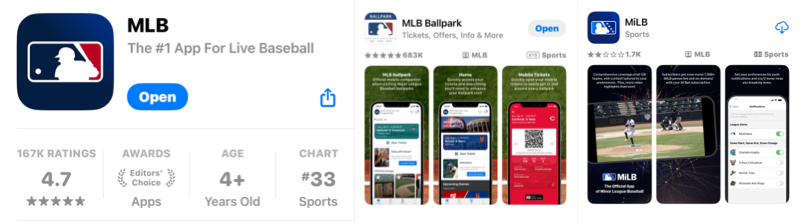
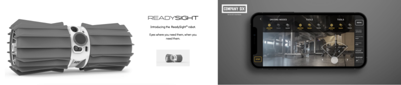

### Hi there 👋, Ben Lee
#### Developer, Artist, Tutor & Skateboard Instructor
At first I was a starving artist. Then I taught myself to code, now I combine them. Now, I'm no longer starving. 

I have 4 passions in life: Art, Coding, Teaching, and Skateboarding.  I've had the privilege to pursue these passions, working as a Designer, Software Developer, Special Needs K-12 CS & Maths Tutor, and Skateboarding Instructor.

## Apps I've Worked On

### Major League Baseball

### Company Six - ReadySight

### K, Online

## Skills 
iOS Development / Swift / Objective-C / SwiftUI / REST / Firebase / UIKit / UI Design / Sketch / Teaching / Skateboarding / Special Needs K-12 Mentoring 

         

<h3 align="left">Languages and Tools:</h3>

## Design & Art Experience
From 2014 to 2015, I worked as a freelance "starving artist" in Bellevue, Washington. To make ends meet, I took on a wide swath of artistic skills, doing graphic design, logos, product diagrams, pamphlets, icons, typography, chalk murals, chalk menus, paintings, and more. 

In late 2015, While I was working on a large commission chalk mural, a man approached and asked if I did UI design. He was a founder of Simple Technologies Inc.  The following week, I was hired as a full time UI Designer for Poi; their iOS app. 

## Development Experience

I taught myself to code in 2016 and landed my first coding job in 2017 as an iOS Developer for K, Online Inc.; a startup based in Seattle, Washington.  

In 2019, I started a 16-month iOS software engineering internship at Major League Baseball in Boulder, Colorado. I completed my internship in the Summer of 2020.

My software development work was a five-month contract from October 2022 to March 2023 at Company Six in Boulder, Colorado where I took over as Lead iOS Engineer.  

      

